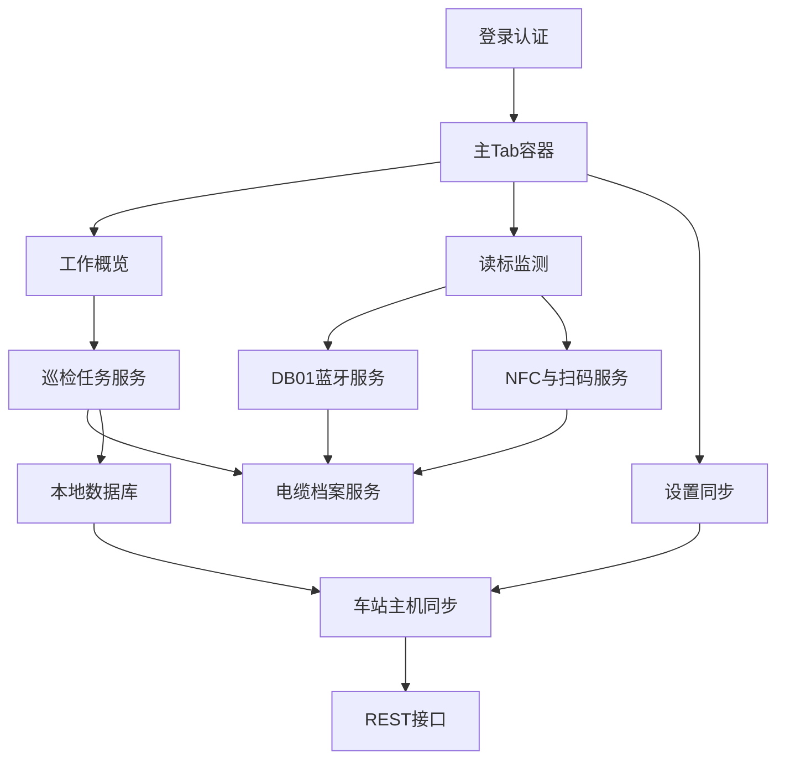

# 铁路信号电缆监测 Android APP 开发计划

## 现状判断

- 需求来源：[e:\需求文档\铁路信号电缆监测系统\安卓APP需求文档初稿.md](e:\需求文档\铁路信号电缆监测系统\安卓APP需求文档初稿.md)，核心能力包括 DB01 蓝牙读标、NFC/RFID/扫码、档案管理、故障定位、巡检闭环、离线同步、登录加密与 Android 12 适配。
- 实际落地工程应以 [SF_HandheldTerminal/SF_HandheldTerminal.csproj](SF_HandheldTerminal/SF_HandheldTerminal.csproj) 为主。当前目标框架包含 `net9.0-android`，但应用名、包名、签名、权限仍是模板状态。
- 当前入口为 [SF_HandheldTerminal/App.xaml.cs](SF_HandheldTerminal/App.xaml.cs) 中 `return new Window(new Login());`，登录后切到 [SF_HandheldTerminal/Views/Main/MainTabPage.xaml](SF_HandheldTerminal/Views/Main/MainTabPage.xaml) 的三 Tab：概览、监测、设置。
- [SF_HandheldTerminal/MauiProgram.cs](SF_HandheldTerminal/MauiProgram.cs) 目前只注册了演示登录服务，Syncfusion 许可仍是注释占位；概览/监测页仍有健康、旅行等模板数据，需要逐步业务化。

## 建议总体架构

## 分阶段实施

### 第一阶段：工程基线与导航骨架

目标是先把应用从模板壳整理成可持续开发的业务壳。

- 明确 `SF_HandheldTerminal` 为主工程，暂不在 `SyncfusionMAUIApp1` 中继续开发业务功能，避免两套模板并行维护。
- 更新 [SF_HandheldTerminal/SF_HandheldTerminal.csproj](SF_HandheldTerminal/SF_HandheldTerminal.csproj)：应用标题、Android 包名、版本号、Release 签名策略、Android 12+ 目标验证清单。
- 处理 Syncfusion 许可注册位置，建议集中放在 [SF_HandheldTerminal/MauiProgram.cs](SF_HandheldTerminal/MauiProgram.cs)，密钥不要硬编码提交。
- 选择并固定导航策略：短期保留现有 `Login -> MainTabPage`；新增业务子页时使用 `NavigationPage` 或统一导航服务，避免继续混用闲置 `AppShell`。
- 将 [SF_HandheldTerminal/Views/Overview.xaml](SF_HandheldTerminal/Views/Overview.xaml)、[SF_HandheldTerminal/Views/Monitoring.xaml](SF_HandheldTerminal/Views/Monitoring.xaml)、[SF_HandheldTerminal/Views/Settings.xaml](SF_HandheldTerminal/Views/Settings.xaml) 的英文模板语义替换为电缆监测业务语义。

交付物：可启动、可登录、主界面为电缆巡检业务框架，无明显 Travel/Health 模板内容。

### 第二阶段：领域模型与本地数据层

目标是先让 UI 有稳定的数据来源，即使硬件和后台未完全就绪也能开发闭环流程。

- 新增领域模型：`CableAsset`、`ElectronicMarker`、`InspectionTask`、`InspectionPoint`、`InspectionRecord`、`FaultPoint`、`DeviceReading`、`SyncOutboxItem`。
- 新增仓储和服务接口：`ICableArchiveService`、`IInspectionTaskService`、`IReadingMatchService`、`ISyncQueueService`。
- 引入 SQLite 本地库，设计本地表和索引：以电子标识器 ID、任务 ID、同步状态为核心索引。
- 对坐标、档案、巡检记录等敏感字段规划加密策略；登录令牌、用户信息使用 `SecureStorage`。
- 先实现 Mock 数据源，支撑概览、任务列表、档案详情、读标匹配等页面联调。

交付物：离线可查看任务和档案，可新增巡检记录，可模拟读标匹配任务点。

### 第三阶段：核心页面业务化

目标是形成现场人员可操作的主流程。

- 概览页：显示今日任务数、已完成点位、异常/待同步记录、DB01 连接状态、最近读标记录。
- 监测页：替换当前旅行列表为“实时读标与信号辅助”页面，展示标识器 ID、信号强度、测算深度、设备电量、匹配档案和任务点。
- 任务页：新增巡检任务列表、任务详情、点位清单、点位完成状态、未完成阻止提交。
- 档案页：按电子标识器 ID 查询管线档案，展示位置、埋深、管径、材质、铺设日期、所属单位、历史巡检/维修记录。
- 采集页：支持拍照、备注、设备状态、测量数据、GPS 坐标、深度信息写入巡检记录。
- 设置页：增加账号、设备连接、同步策略、离线缓存、日志导出、退出登录，建议新增 `SettingsViewModel`。

交付物：完成“登录 -> 任务 -> 读标 -> 档案 -> 巡检记录 -> 提交前校验”的 APP 主流程。

### 第四阶段：Android 硬件能力接入

目标是把 Mock 读数替换为真实设备能力，同时保留 Mock 便于开发和演示。

- DB01 蓝牙：定义 `IDb01Client`、`IDb01PacketParser`，先实现模拟客户端，再根据 DB01 协议规格书实现 Android BLE/SPP 客户端。
- Android 权限：在 [SF_HandheldTerminal/Platforms/Android/AndroidManifest.xml](SF_HandheldTerminal/Platforms/Android/AndroidManifest.xml) 补齐蓝牙、定位、相机、NFC、网络状态等权限，并实现运行时权限申请。
- NFC：封装 `INfcReader`，处理 ISO/IEC 14443A 标签读取、前台调度、标签 ID 归一化。
- 二维码：接入扫码库或厂商扫描引擎，统一输出为 `DeviceReading`。
- RFID：若硬件为选配或依赖厂商 SDK，先定义接口和占位实现，拿到 SDK 后替换。
- GPS/北斗：封装定位服务，记录经度、纬度、精度、采集时间；与 DB01 深度组合成三维坐标。
- 相机：使用 MAUI MediaPicker 或 Android 原生能力拍摄现场照片，并压缩、缓存、关联巡检记录。

交付物：真实 DB01/NFC/扫码/GPS/相机至少完成一轮真机验证；无设备时仍可用 Mock 模式开发。

### 第五阶段：车站主机接口与离线同步

目标是在弱网现场保证数据完整，网络恢复后可靠同步。

- 定义 `IStationApi` 与 DTO：登录、任务下载、档案查询、巡检记录上传、照片上传、同步状态回执。
- 实现 `HttpClient` 封装：超时、重试、认证头、统一错误处理、接口日志脱敏。
- 建立 Outbox 同步队列：本地先落库，后台按顺序上传；失败保留重试次数、错误码和最后失败原因。
- 支持 Wi-Fi/4G 网络状态检测，设置页显示“待同步/同步中/失败/完成”。
- 大文件照片采用压缩、分批上传或断点续传策略，避免阻塞巡检主流程。

交付物：断网可采集，恢复网络后自动同步；同步失败可在设置页查看并手动重试。

### 第六阶段：安全、可靠性与现场体验

目标是满足工业手持机现场使用要求。

- 登录认证从 `DemoLoginAuthService` 迁移到真实 API，并支持记住账号、安全令牌、过期刷新。
- 评估并接入 Android 生物识别能力；若 LYHR-803S 指纹/人脸 SDK 独立，先用接口隔离。
- 本地数据库事务化保存采集记录，防止断电或应用崩溃导致数据丢失。
- 设计户外高对比、大字号、大触控主题：按钮高度、列表行高、Tab 高度、关键状态颜色统一。
- 对蓝牙/GPS/后台同步做功耗控制：页面离开停止高频扫描，后台任务限频，必要时增加手动刷新。
- 增加本地日志：蓝牙连接、解析失败、同步失败、权限拒绝、崩溃诊断，支持导出给研发排查。

交付物：主流程在弱网、断电恢复、权限拒绝、设备断连等场景下行为可控。

### 第七阶段：测试与发布验收

目标是让应用具备可交付、可维护、可回归的质量基础。

- 单元测试：DB01 数据包解析、读标匹配、任务完成校验、同步队列状态机。
- 集成测试：Mock API + 本地数据库 + 页面 ViewModel 主流程。
- 真机测试：LYHR-803S Android 12、5.0/5.72 英寸屏幕、DB01 蓝牙、NFC、相机、GPS、4G/Wi-Fi 切换。
- 发布配置：Release 签名、应用图标、启动图、包名、版本号、混淆/裁剪策略、Syncfusion 许可、隐私权限说明。
- 验收用例：按需求文档逐条覆盖“蓝牙读标、NFC/扫码、档案查阅、巡检闭环、故障定位、离线同步、安全登录”。

交付物：可安装 APK/AAB、验收清单、接口文档、设备联调记录、已知问题列表。

## 推荐开发顺序

1. 先完成工程基线和模板替换，避免继续在演示结构上叠业务。
2. 再做领域模型、本地库和 Mock 服务，让 UI 与流程可独立推进。
3. 接着做任务闭环和读标匹配，这是 APP 的核心业务价值。
4. 然后接入 DB01、NFC、扫码、GPS、相机等 Android 真机能力。
5. 最后做同步、安全、功耗、发布和验收。

## 关键风险

- DB01 私有蓝牙协议未明确前，只能先做接口和模拟解析；真实解析需等待规格书或抓包样例。
- LYHR-803S 的 RFID、指纹、人脸等选配模块可能需要厂商 SDK，不能只依赖标准 MAUI API。
- 当前项目使用 Syncfusion 控件较多，正式发布前必须解决许可证、版本锁定和真机性能回归。
- 现有工作区已有未跟踪的 `obj/Release` 构建产物，后续开发前建议清理并完善 `.gitignore`，避免误提交。