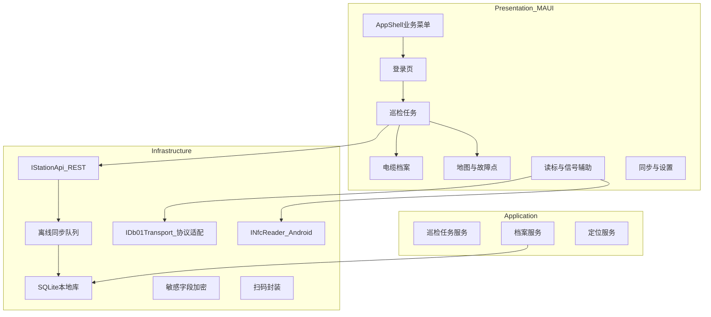

# 铁路信号电缆监测安卓 APP（基于 SyncfusionMAUIApp1）开发计划

## 现状与目标对齐

- **需求来源**：[安卓APP需求文档初稿.md](e:\需求文档\铁路信号电缆监测系统\安卓APP需求文档初稿.md) 定义了手持机 LYHR-803S、DB01 蓝牙、NFC/RFID/扫码、档案与任务、地图与故障标定、车站主机同步、登录与加密等非功能要求。
- **工程现状**：[`SyncfusionMAUIApp1.csproj`](e:\LearnSpace\AndroidAppLearn\SyncfusionMAUIApp1\SyncfusionMAUIApp1.csproj) 已配置 MAUI + Syncfusion（DataGrid、Charts、Maps 等）；[`AppShell.xaml`](e:\LearnSpace\AndroidAppLearn\SyncfusionMAUIApp1\AppShell.xaml) 为演示菜单；[`MauiProgram.cs`](e:\LearnSpace\AndroidAppLearn\SyncfusionMAUIApp1\MauiProgram.cs) 已 `ConfigureSyncfusionCore()`；[`App.xaml.cs`](e:\LearnSpace\AndroidAppLearn\SyncfusionMAUIApp1\App.xaml.cs) 已注册许可证。
- **改造原则**：在**同一解决方案内**增量演进——新增业务页面与服务，**逐步替换**演示 Flyout；演示页可暂留为「控件参考」或移至单独菜单分组，避免一次性大删导致回归困难。

## 总体架构（建议）

- **UI 层**：MAUI 页面 + ViewModel（可选用 MVVM Toolkit），大屏手套友好样式集中在 [`Resources/Styles`](e:\LearnSpace\AndroidAppLearn\SyncfusionMAUIApp1\Resources\Styles)。
- **领域/应用层**：任务状态机（未扫/已扫/可提交）、标识器 ID 与档案关联规则、合规性校验（计划内 ID 全部读取）。
- **基础设施层**：REST 抽象、SQLite、加密、蓝牙/NFC 等平台能力通过**接口 + Android 实现**（[`Platforms/Android`](e:\LearnSpace\AndroidAppLearn\SyncfusionMAUIApp1\Platforms\Android)），便于无硬件时联调。

## 与需求条目的映射（复用 Syncfusion）

| 需求模块 | 在工程中的落点 |
|----------|----------------|
| 档案列表、工单列表、历史记录 | 复用并改写 **DataGrid** 模式（参考现有 [`DataGridFeatures.xaml`](e:\LearnSpace\AndroidAppLearn\SyncfusionMAUIApp1\DataGridFeatures.xaml) / [`DataGridViewModel.cs`](e:\LearnSpace\AndroidAppLearn\SyncfusionMAUIApp1\ViewModel\DataGridViewModel.cs)），绑定业务模型而非订单演示数据。 |
| 信号强度可视化 | **Cartesian/Circular Charts**（参考 [`CartesianChartsFeatures.xaml`](e:\LearnSpace\AndroidAppLearn\SyncfusionMAUIApp1\CartesianChartsFeatures.xaml)）做实时曲线或仪表盘；音频提示用 `Plugin.Maui.Audio` 或 Android 层短促提示音（需评估包体与许可）。 |
| 地图与埋点/故障点 | 在 [`MapsFeatures.xaml`](e:\LearnSpace\AndroidAppLearn\SyncfusionMAUIApp1\MapsFeatures.xaml) 基础上改为：**当前 GPS 点 + 标识器/故障点标记**；离线场景需规划 **瓦片/矢量离线方案**（与需求「大容量离线地图」一致；具体数据源需产品确认是否用站内离线包或 OSM 等）。 |
| 树形档案（可选） | 现有 **TreeView** 可作为「单位—线路—区段」层级导航原型。 |

## 分阶段实施（建议顺序）

### 阶段 A：工程骨架与导航（1–2 周量级，视人力调整）

- 新建文件夹：`Models/`、`Services/`、`Pages/`（或 `Views/`）、`ViewModels/`、`Contracts/`（API DTO）、`Platforms/Android/Handlers/`（如需要）。
- 重写 [`AppShell.xaml`](e:\LearnSpace\AndroidAppLearn\SyncfusionMAUIApp1\AppShell.xaml)：Flyout 菜单改为业务项，例如：登录、今日任务、读标与信号、电缆档案、地图、同步与设置；原演示页可折叠到「开发演示」分组或 `#if DEBUG`。
- **应用入口**：未登录进登录页；登录后进任务首页（[`App.xaml.cs`](e:\LearnSpace\AndroidAppLearn\SyncfusionMAUIApp1\App.xaml.cs) 的 `CreateWindow` 或 Shell 路由策略二选一，保持单一职责）。
- **全局样式**：在 [`Resources/Styles/Styles.xaml`](e:\LearnSpace\AndroidAppLearn\SyncfusionMAUIApp1\Resources\Styles\Styles.xaml) 增加高对比、大触控目标（手套）、户外可读配色（需求 3.4）。

### 阶段 B：数据模型与本地持久化

- 定义核心实体：`CableArchive`、`MarkerReading`、`InspectionTask`、`TaskItem`、`InspectionRecord`、`SyncOutbox` 等（字段对齐需求：标识器 ID、深度、RSSI、电量、坐标、照片路径、操作人等）。
- 引入 **SQLite**（如 `sqlite-net-pcl`）存档案缓存、任务、离线队列；敏感字段（坐标、档案详情）走 **加密列或应用层加密**（需求 3.3），密钥来源需设计（设备绑定或登录派生，具体需安全评审）。
- **意外中断不丢数据**：写操作采用事务 + Outbox 模式；媒体文件先落本地再登记数据库记录。

### 阶段 C：车站主机 REST 与同步

- 定义 `IStationApi` 与 DTO（任务下发、档案拉取、巡检记录上传）；实现可用 **Refit** 或 `HttpClient` + 源生成序列化。
- **配置**：基础地址、超时、重试策略；`MauiProgram.cs` 中 DI 注册。
- **后台智能同步**：网络状态监听 + 队列重试；弱网只入队不入主表或标记待同步（与需求 2.6 一致）。
- **阻塞项**：正式 URL、鉴权方式（Token/证书）需接口文档；计划内先以 **Mock 服务** + JSON 本地文件驱动 UI。

### 阶段 D：DB01 蓝牙与信号展示

- 抽象 `IDb01Client`：`Connect/Disconnect`、`SubscribeReadings`、`Battery` 等；**解析层单独** `IDb01PacketParser`（便于拿到规格书后只换解析器）。
- **Android**：BLE 与经典蓝牙 SPP 二选一需按 DB01 规格书确定；实现放在 `Platforms/Android` 或使用成熟 **BLE 插件**（需评估与工业机兼容性）。
- **无协议阶段**：用模拟器定时推送随机 RSSI/深度/ID，驱动 Charts 与强度条，保证 UI/任务联调路径畅通。
- **权限**：在 Android Manifest 中声明蓝牙、定位（若蓝牙扫描需要）、附近设备权限等（随目标 SDK 调整）。

### 阶段 E：NFC、RFID、二维码

- **NFC（ISO14443A）**：MAUI 无统一 NFC API，需 **Android `NfcAdapter` 封装**（`MainActivity` 处理 `Intent` + 前台调度），通过接口暴露标签 UID/NDEF 到共享层。
- **RFID**：依赖 LYHR-803S 是否提供厂商 SDK；计划中为 `IRfidReader` 占位 + 厂商对接文档任务。
- **二维码**：优先 `ZXing.Net.Maui` 或设备扫描引擎厂商 API（需求写明扫描引擎）；统一 `IQrScanService`。

### 阶段 F：定位与地图业务化

- 使用 `Microsoft.Maui.Devices.Sensors` 的 **Geolocation** 获取经纬度；与 DB01 深度组合为「三维记录」模型。
- 地图页：从演示澳洲 JSON 改为 **业务图层**（点集合、线路 Polyline）；若 Syncfusion 当前用法不满足国内离线合规，需单独评估 **地图 SDK** 或离线瓦片方案（此为产品/合规决策点，开发计划保留接口层）。

### 阶段 G：巡检任务闭环（核心业务）

- 任务详情：待扫 ID 列表、逐项自动匹配读标事件、拍照、深度/坐标写入记录。
- **合规**：提交前校验所有计划 ID 已读；未满足则禁止提交并提示缺失项。
- 与阶段 B/C 的本地库、同步队列打通。

### 阶段 H：安全与登录

- 用户名密码 + **Android BiometricPrompt**（指纹/人脸由系统与设备能力决定）；工业指纹模块若走系统 API 则可统一；否则需厂商 SDK 分支。
- 会话与 Token 安全存储（Android Keystore 绑定）。

### 阶段 I：非功能与发布准备

- **目标**：`SupportedOSPlatformVersion` 已 Android 21+，需求要求 **Android 12+ 兼容**——在真机/模拟器 API 31+ 验证；[`csproj`](e:\LearnSpace\AndroidAppLearn\SyncfusionMAUIApp1\SyncfusionMAUIApp1.csproj) 中 `ApplicationId`、应用名改为正式包名。
- **性能**：蓝牙/GPS/相机后台行为审查，避免无效轮询；大图压缩与缓存策略。
- **测试**：无硬件用 Mock；有 LYHR-803S + DB01 做端到端验收（协议、断连重连、弱网）。

## 关键依赖与风险（需在计划中显式跟踪）

1. **DB01 私有蓝牙协议**：无规格书则只能 Mock；拿到后仅替换 `IDb01PacketParser` 与传输细节。
2. **车站 REST 契约**：无 OpenAPI 则先定团队内部契约与 Mock。
3. **地图与离线**：法律与数据源选型影响实现，接口层先固定「图层模型」。
4. **RFID/扫描引擎**：可能依赖厂商 Jar/AAR，需评估是否引入 **.NET for Android 绑定库** 或原生服务桥接。

## 建议的首批可交付里程碑（便于验收）

1. **M1**：新 Shell + 登录壳 + 任务列表（Mock 数据）+ 户外主题样式。
2. **M2**：SQLite 档案缓存 + 单条档案详情页（含照片占位）。
3. **M3**：Mock DB01 数据驱动信号图 + 强度条 + 简单提示音。
4. **M4**：巡检任务读标自动匹配 + 提交校验 + 离线队列。
5. **M5**：真机蓝牙/NFC/GPS 打通（视硬件与协议到位情况）。
